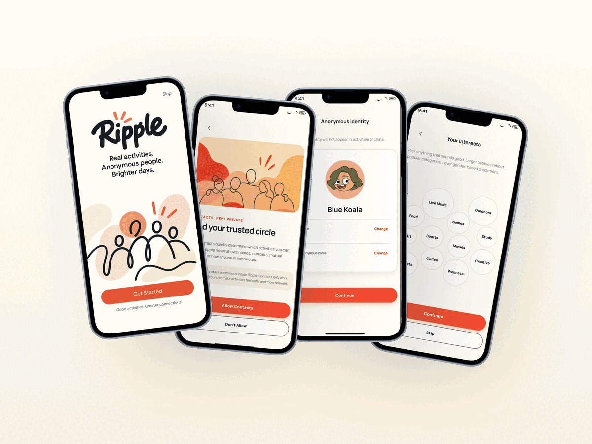

# Ripple

> **Meet by interest, connect by chance.**

Ripple is an activity-first social app prototype that makes it easier to turn shared interests into real-world plans. Instead of asking people to decide whether to approach a stranger, Ripple starts with a simpler question: **“Does this sound like something I’d enjoy?”**

Users can discover, create, and join activities such as coffee catch-ups, walks, concerts, and community workshops—then get to know fellow attendees in an anonymous group chat before meeting in person.

[Try the live demo](https://qinghao-f.github.io/ripple/) · [Explore the component library](https://ripple-component-library.qhfang32.chatgpt.site) · [Open the Figma design](https://www.figma.com/design/Lj6YarTkYiHFfibWnEYtZX/WIT?node-id=0-1&t=QWelUHROx1NUUdIp-1)



## The idea

Cities are becoming denser, yet social life can still feel isolating. Even when people want to meet others, the first step—who to ask, what to say, whether it will feel awkward—can become an invisible barrier.

Ripple is designed to lower that barrier through shared context. Contact connections and common interests help surface relevant plans in the background, while the activity itself gives people a natural reason to connect. The goal is not profile matching; it is helping people find something worth doing together.

## What you can do

- **Discover activities your way.** Browse personalised recommendations on the Poster Board, explore nearby plans on a map, or organise upcoming activities in My Plans.
- **Find both familiar and unexpected ideas.** Interest-aware categories keep discovery relevant, while Trends and Explore encourage users to try activities that people with similar interests enjoy.
- **Join with enough context to decide.** Activity pages show the time, broad area, cost, capacity, and other practical details before someone joins.
- **Create and promote plans.** Members and community organisers can publish activities, generate a poster, preview it, and manage their own posts.
- **Start conversations with a purpose.** Each activity has an anonymous group chat, suggested replies, and a shared reason to talk before the event.

## Privacy and safety by design

Ripple explores a gradual approach to social discovery:

- **Anonymous but relevant:** contacts can help make recommendations socially meaningful, without exposing names, phone numbers, or relationship paths.
- **Location unfolds over time:** an activity card shows only an approximate location; the precise meeting place is shared in the group chat after joining.
- **Safer first-time hosting:** first-time organisers are limited to public venues.
- **Community controls:** reporting, blocking, and leave-activity flows help users manage unwanted behaviour and contact.

## Prototype walkthrough

The interactive demo includes:

1. An onboarding flow for phone number, verification code, contacts permission, anonymous identity, age confirmation, and interests.
2. Poster Board, Map, and My Plans activity discovery modes.
3. Activity detail, join confirmation, calendar, and plan-management screens.
4. Activity creation, poster generation, preview, and publishing flows.
5. Anonymous group chats, quick-reply suggestions, cancellation states, and moderation controls.

## How we built it

We began with sketches and team discussions about how to make local socialising feel less intimidating. We translated the product direction into a design system, a component library, and interaction specifications, then used an iterative vibe-coding workflow to build and refine a high-fidelity prototype.

The repository is a lightweight static front-end built with **JavaScript** and **CSS**—no build step or package installation is required.

### What we learned

Giving AI a coherent design system and interaction specification produced a much stronger result than isolated prompts. Product-wise, we learned that an activity can carry much of the social load: once people have a shared plan, starting a conversation feels more natural than opening an empty chat with a stranger.

## Run locally

```sh
git clone https://github.com/Qinghao-F/ripple.git
cd ripple
python3 -m http.server 4177
```

Then open [http://localhost:4177](http://localhost:4177) in a current version of Chrome, Safari, Edge, or Firefox.

To enter the demo, use:

- Mobile number: `0412 345 678`
- Verification code: `123456`

> This is a front-end prototype. Phone verification, contacts, location, poster generation, and chats are simulated; no personal data is collected or sent.

## Project structure

```text
.
├── index.html                    # App entry point and iPhone preview shell
├── onboarding.html               # Onboarding entry point
├── app.js                        # Screens, state, and demo interactions
├── styles.css                    # App layouts and components
├── ios-shell.css                 # iPhone safe-area and iOS refinements
├── welcome.css                   # Welcome-screen styling
├── assets/screenshots/           # README product gallery
├── Ripple_Component_Library/     # Shared tokens, styles, and artwork
└── IOS_HIG_REVIEW.md             # iOS layout and accessibility review notes
```

## What’s next

The next step is to test whether an activity-first, anonymous-but-relevant experience makes people more willing to join plans they might otherwise hesitate to attend. We also want to expand from small member-created plans into concerts, exhibitions, and other events already happening around the city.

Today you join a plan. Tomorrow, you might start one.

## Credits

Ripple brand assets and component patterns are included in this repository for this demo. Iconography is provided through [Iconoir](https://iconoir.com/).
